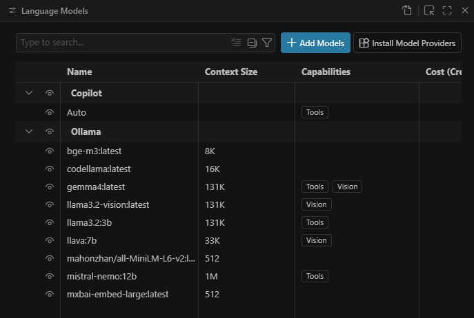

# Desenvolvimento orientado a especificações com LLMs locais e livres aplicados à cartografia

**Alunos:** 

**Idéia chave:** Investigar como LLMs locais e livres podem ser usados para transformar especificações cartográficas em procedimentos computacionais verificáveis, integrados a ferramentas abertas de geoprocessamento, visando aumentar a reprodutibilidade, a automação e a qualidade da produção cartográfica.


## Requisitos inicialmente pensados

### Docker

  * Windows:
    * Fazer o download e instalar [Start Docker Desktop](https://docs.docker.com/desktop/install/windows-install/ "Start Docker Desktop"); e
    * Fazer o download e instalar o [Windows Subsystem for Linux Kernel](https://wslstorestorage.blob.core.windows.net/wslblob/wsl_update_x64.msi "Windows Subsystem for Linux Kernel") (wsl2kernel)


  * Mac:
    * Fazer o download e instalar [Install Docker Desktop on Mac](https://docs.docker.com/desktop/setup/install/mac-install/)

  * Debian/Ubuntu: 
    ```shell
    curl -fsSL https://get.docker.com -o get-docker.sh
    sh get-docker.sh
    apt install docker-compose
    ```

### Ollama

O [Ollama](https://ollama.com/) é uma ferramenta para baixar, executar e gerenciar
modelos de linguagem (LLMs) localmente. Ele disponibiliza uma interface de linha de
comando e uma API HTTP, permitindo usar os modelos sem enviar os dados para um
serviço externo. O processamento é feito na própria máquina; por isso, o desempenho
e os modelos que podem ser executados dependem da memória RAM e, quando utilizada,
da memória da GPU.

Os modelos disponíveis podem ser consultados na
[biblioteca de modelos do Ollama](https://ollama.com/library). Antes de usar um
modelo, confira na página dele o tamanho, os requisitos de hardware, os recursos
suportados e sua licença. Para baixar um modelo, por exemplo:

```shell
ollama pull llama3.2:3b
```

Para este fluxo precisaremos de um serviço Ollama com alguns modelos instalados:


```shell
docker run -d \
  --name ollama \
  --restart unless-stopped \
  -p 11434:11434 \
  -v ./ollama/models:/root/.ollama \
  -e DEFAULT_MODEL=llama3.2 \
  --gpus all \
  ollama/ollama:latest
```

container name | image | ports | url
---- | ----- | --- | ----
ollama | ollama/ollama:latest | 11434:11434 | http://localhost:11434

Depois de baixar e iniciar um modelo, também é possível enviar uma pergunta pela
API local. O exemplo abaixo usa o endpoint `POST /api/generate`; a opção
`"stream": false` faz a resposta ser devolvida em um único objeto JSON. Os
exemplos abaixo mostram a chamada com `curl` e com Python:

Em Linux/MacOS/Bash:
```shell
curl http://localhost:11434/api/generate \
  -H "Content-Type: application/json" \
  -d '{
    "model": "llama3.2:3b",
    "prompt": "Explique em poucas palavras o que é cartografia temática.",
    "stream": false
  }'
```

Em Python, com a biblioteca `requests` instalada (`pip install requests`):
```shell
python -c "import requests; response=requests.post('http://localhost:11434/api/generate', json={'model':'llama3.2:3b','prompt':'Explique em poucas palavras o que é cartografia temática.','stream':False}); response.raise_for_status(); print(response.json()['response'])"
```

O nome informado em `model` deve corresponder a um modelo exibido por
`ollama list`. A referência completa da API está na
[documentação do Ollama](https://docs.ollama.com/api/generate).

Abra o terminal do container Docker para rodar modelos LLM (run/pull):

```shell
# if started by a docker-compose:
> docker-compose exec -it ollama /bin/bash
# if started by a docker run:
> docker exec -it ollama /bin/bash

root@f711e0c5c3f8:/# ollama list
NAME                        ID              SIZE      MODIFIED     
llama3.2:3b                 a80c4f17acd5    2.0 GB    23 hours ago    
mxbai-embed-large:latest    468836162de7    669 MB    24 hours ago    
gemma4:latest               c6eb396dbd59    9.6 GB    24 hours ago    
root@f711e0c5c3f8:/# ollama run gemma4
Error: 500 Internal Server Error: model requires more system memory (7.0 GiB) than is available (1.8 GiB)
# Novamente em um PC melhor:
root@b833d20ab5bd:/# ollama run gemma4
 Model
    architecture        gemma4
    parameters          8.0B
    context length      131072
    embedding length    2560
    quantization        Q4_K_M
    requires            0.20.0

  Capabilities
    completion
    vision        
    audio
    tools
    thinking
root@f711e0c5c3f8:/# ollama run llama3.2
...
success
>>> Send a message (/? for help)
>>> /?
Available Commands:
  /set            Set session variables
  /show           Show model information
  /load <model>   Load a session or model
  /save <model>   Save your current session
  /clear          Clear session context
  /bye            Exit
  /?, /help       Help for a command
  /? shortcuts    Help for keyboard shortcuts

# Use """ to begin a multi-line message
>>> /show info
  Model
    architecture        llama
    parameters          3.2B
    context length      131072
    embedding length    3072
    quantization        Q4_K_M

  Capabilities
    completion
    tools
    ...
```

Ollama free plan limita a 1 modelo em nuvem (Pro, 3 and Max,10)

```shell
root@f711e0c5c3f8:/# ollama run deepseek-v3.2:cloud
Connecting to 'deepseek-v3.2:cloud' on 'ollama.com' ⚡
>>> /show info
  Model 
    architecture        deepseek3.2     
    parameters          671B    
    context length      163840
    embedding length    7168
    quantization        FP8

  Capabilities
    completion
    tools
    thinking
    ...
```

### VS Code integrado ao Ollama

O Visual Studio Code pode usar os modelos executados pelo Ollama diretamente no
chat do editor. Assim, perguntas sobre o projeto e tarefas como explicar, gerar ou
corrigir código podem ser processadas localmente. Segundo a
[documentação oficial da integração](https://docs.ollama.com/integrations/vscode),
são necessários Ollama 0.18.3 ou posterior, VS Code 1.113 ou posterior e a extensão
GitHub Copilot Chat 0.41.0 ou posterior.

1. Instale a extensão Ollama, assim todos os modelos já baixados estarão visíveis para integração. 
2. Abra a paleta de comandos com `Ctrl+Shift+P` e execute
   **Chat: Manage Language Models**. A mesma janela pode ser aberta pela opção
   **Manage Models...** no seletor de modelos do Chat.
   
<center></center>

3. Selecione o modelo.

4. Teste simples. Pergunte ao chat "Adicione um arquivo add.py que recebe uma lista de números via linha de comando e os soma"

#### Configuração do modelo utilitário

Ao selecionar um modelo local, o VS Code pode exibir a mensagem:

```text
No utility model is configured for 'copilot-utility-small' while the selected main agent model is BYOK.
```

Isso acontece porque o modelo principal foi adicionado por BYOK (*Bring Your Own
Key*), mas o editor ainda não sabe qual modelo deve executar tarefas auxiliares,
como identificar a intenção do pedido, criar títulos e gerar mensagens de commit.
Para corrigir:

1. Clique na engrenagem **Manage** no canto inferior esquerdo do VS Code e depois
   em **Settings**. Como alternativa, abra a paleta com `Ctrl+Shift+P`, digite
   **Preferences: Open Settings (UI)** e pressione `Enter`.
2. Na caixa **Search settings**, na parte superior da tela de configurações,
   pesquise por `chat.utilitySmallModel`.
3. Em **Chat: Utility Small Model**, selecione o mesmo modelo local do Ollama ou
   outro modelo local pequeno e rápido.
4. Pesquise por `chat.utilityModel` e, em **Chat: Utility Model**, selecione também
   um modelo local.
5. Abra um novo Chat. Se o modelo não aparecer nas listas, execute
   **Developer: Reload Window** pela paleta de comandos e tente novamente.
6. Volte para a janela de **Manage Models...** e selecione o modelo "Auto"

O modelo principal e o utilitário não precisam ser iguais. Por exemplo, um modelo
maior pode ser usado no modo agente e `qwen2.5-coder:1.5b` pode atender às tarefas
auxiliares, desde que essa variante também esteja baixada no Ollama. Segundo a
[documentação de modelos do VS Code](https://code.visualstudio.com/docs/agent-customization/language-models),
modelos BYOK podem ser usados tanto no Chat quanto nessas tarefas utilitárias.


#### Modelos populares para geração de código

A tabela apresenta alguns dos modelos de código mais baixados da
[biblioteca do Ollama](https://ollama.com/search?q=coder). Modelos maiores tendem a
exigir mais memória; portanto, comece por uma variante menor e aumente o tamanho de
acordo com o hardware disponível.

modelo | tamanhos disponíveis | exemplo para baixar | uso principal
--- | --- | --- | ---
[Qwen2.5-Coder](https://ollama.com/library/qwen2.5-coder) | 0.5B a 32B | `ollama pull qwen2.5-coder:7b` | geração, explicação e correção de código
[Qwen3-Coder](https://ollama.com/library/qwen3-coder) | 30B e 480B | `ollama pull qwen3-coder:30b` | programação com ferramentas e fluxos agênticos
[Code Llama](https://ollama.com/library/codellama) | 7B a 70B | `ollama pull codellama:7b` | geração e discussão de código
[DeepSeek Coder](https://ollama.com/library/deepseek-coder) | 1.3B a 33B | `ollama pull deepseek-coder:6.7b` | geração de código com baixo consumo nas variantes menores
[CodeGemma](https://ollama.com/library/codegemma) | 2B e 7B | `ollama pull codegemma:7b` | completação, geração e compreensão de código
[StarCoder2](https://ollama.com/library/starcoder2) | 3B, 7B e 15B | `ollama pull starcoder2:7b` | programação em diversas linguagens

Consulte sempre a página do modelo para verificar sua licença, tamanho de download,
janela de contexto e variantes disponíveis.

### Langflow

O [Langflow](https://www.langflow.org/) é uma plataforma visual de código aberto
para criar e testar aplicações baseadas em IA. Por meio de uma interface de fluxos,
é possível conectar modelos de linguagem, prompts, agentes, ferramentas, bancos
vetoriais e fontes de dados, reduzindo a quantidade de código necessária para
prototipar uma aplicação. Os fluxos criados também podem ser executados e integrados
a outras aplicações por API.

#### Instalação com Docker

Com o Docker instalado e em execução, inicie a imagem oficial do Langflow com:

```shell
docker run -d \
  --name langflow \
  --restart unless-stopped \
  -p 7860:7860 \
  -e LANGFLOW_AUTO_LOGIN=true \
  -v langflow-data:/app/langflow \
  langflowai/langflow:latest
```

O Docker baixa a imagem automaticamente caso ela ainda não esteja disponível na
máquina. Depois que o contêiner iniciar, abra
[http://localhost:7860](http://localhost:7860) no navegador. A variável
`LANGFLOW_AUTO_LOGIN=true` simplifica o uso local ao desativar a tela de login; ela
não deve ser usada para publicar o serviço na internet. O volume `langflow-data`
mantém os dados do Langflow mesmo que o contêiner seja removido.

Para acompanhar a inicialização ou interromper o serviço, utilize:

```shell
docker logs -f langflow
docker stop langflow
docker start langflow
```

Para ambientes que precisam de autenticação, PostgreSQL e configuração mais
completa, consulte a
[documentação oficial de implantação do Langflow com Docker](https://docs.langflow.org/deployment-docker).

### Chaves de API

Vários serviços exigem a criação de chave de api, credenciais de autenticação, OAuth..

#### Para o GMAIL e GDRIVE

Acesse https://console.cloud.google.com/ --> Menu Google Cloud--> API e serviços --> Credenciais --> crie um porjeto se necessário --> Menu Clientes --> Criar ID do cliente do OAuth --> Em Origens Javascript adicione [http://localhost:5678] e URLs de redirecionamento autorizados adicione [http://localhost:5678/rest/oauth2-credential/callback] ou adicione as URL do app que irão usar aas chaves --> Criar

Volte em Menu Google Cloud--> API e serviços --> API e serviços ativados --> + Ativar APIs e serviços --> Em pesquisar procure Gmail API e Google Drive API e ative-os

#### Para Mistral AI

Acesse https://mistral.ai/ --> Try Studio --> Cadastre-se e realize Login --> https://console.mistral.ai/home --> Configurar o Plano Experiment --> Chaves de API --> Minhas Chaves de API --> + Adicionar uma nova chave
